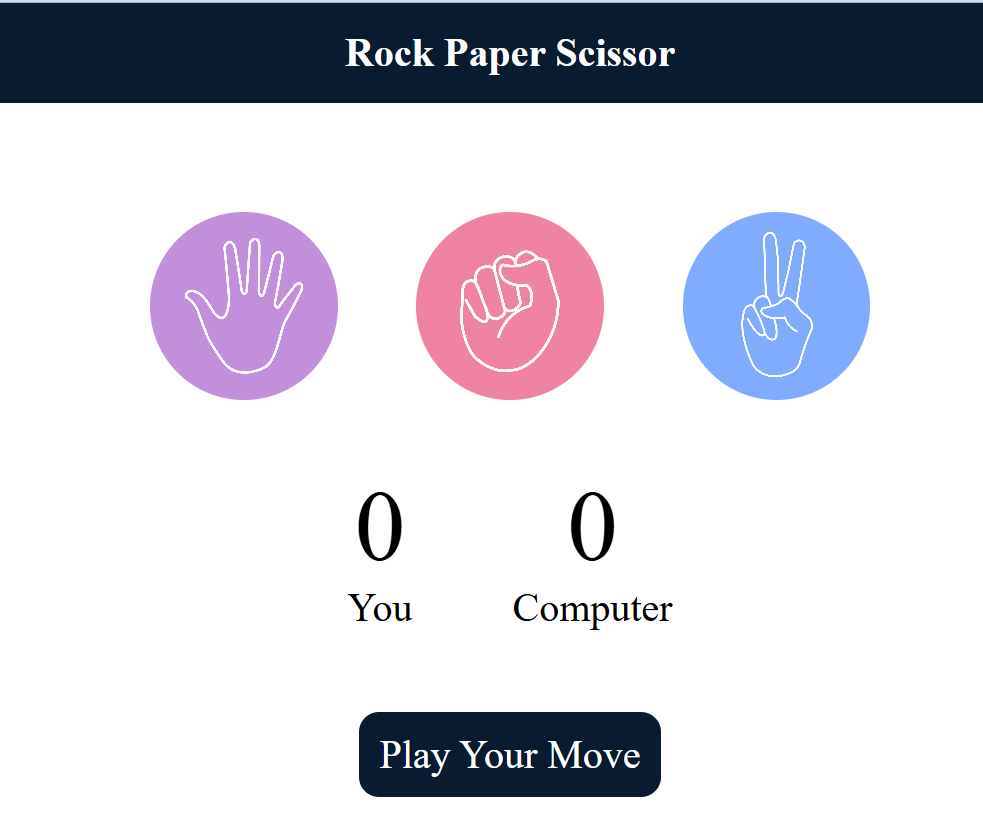

# 🎮 Rock Paper Scissors Game

A simple and interactive **Rock Paper Scissors** game built using **HTML, CSS, and JavaScript**. Play against the computer, track scores in real time, and enjoy a clean, responsive UI.

---

## 📸 Preview

<p align="center">
  
</p>

> *Preview image size is kept moderate for a clean and appealing look.*

---

## 🚀 Features

* 🎯 Play Rock, Paper, or Scissors against the computer
* 🤖 Computer choice generated randomly
* 📊 Live score tracking for both player and computer
* 🎨 Visual feedback for Win / Lose / Draw results
* 🖱️ Click-based gameplay with smooth hover effects

---

## 🛠️ Tech Stack

* **HTML5** – Structure of the game
* **CSS3** – Styling and layout
* **JavaScript (Vanilla)** – Game logic and interactivity

---

## 📂 Project Structure

```text
Rock-Paper-Scissors/
│
├── index.html      # Main HTML file
├── style.css       # Styling
├── script.js       # Game logic
└── images/          # Game images (rock, paper, scissors, preview)
```

---

## 🎮 How to Play

1. Open `index.html` in your browser
2. Click on **Rock**, **Paper**, or **Scissors**
3. The computer will make its choice automatically
4. The result will be displayed instantly
5. Scores update after every round

---

## 🧠 Game Logic Overview

* If both player and computer choose the same option → **Draw**
* Rock beats Scissors
* Scissors beats Paper
* Paper beats Rock

The game compares the user choice with a randomly generated computer choice and updates the score accordingly.

---

## ✨ UI Highlights

* Circular choice buttons with hover effects
* Dark-themed header and message area
* Large, readable score display
* Responsive and centered layout

---

## 📌 Future Improvements

* 🔊 Add sound effects
* 🕹️ Add reset button
* 📱 Improve mobile responsiveness
* 🧩 Add animations for choices

---

## 📄 License

This project is open-source and free to use for learning and personal projects.

---

### 🙌 Author

Developed with ❤️ by **Sushanth**

Happy Coding! 🚀
